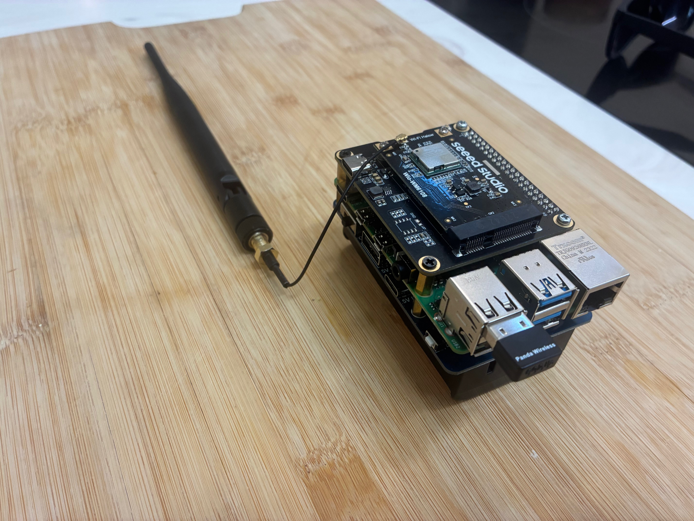

# Example Enclosure

This sample enclosure documents the expected level of detail for OpenMANET builds. Use it as a starting point when you document your own hardware, swapping in your enclosure-specific files, wiring notes, and mechanical considerations.

## Overview

- Houses a Raspberry Pi 4, HaLow radio, antennas, and optional power accessories.
- Demonstrates how to call out required vs optional parts so builders can adapt to their needs.
- Intended for field-friendly deployments where ruggedness and quick maintenance matter.

## Reference photo

> Store high-resolution photos inside a `pics/` subdirectory (or similar) and link to them with relative paths so GitHub renders the image inline.

## Recommended Parts List

| Item | Optional |
|------|----------|
| [Wio WM6180 Wi-Fi HaLow mini PCIe Module](https://www.seeedstudio.com/Wio-WM6180-Wi-Fi-HaLow-mini-PCIe-Module-p-6394.html) | No |
| [WM1302 Pi Hat](https://www.seeedstudio.com/WM1302-Pi-Hat-p-4897.html) | No |
| [External Antenna 868/915 MHz 2 dBi SMA Foldable](https://www.seeedstudio.com/External-Antenna-868-915MHZ-2dBi-SMA-L195mm-Foldable-p-5863.html) | No |
| [UF.L to SMA-K 1.13 mm Cable (120 mm)](https://www.seeedstudio.com/UF-L-SMA-K-1-13-120mm-p-5046.html) | No |
| [Raspberry Pi 4 Model B (1 GB or greater)](https://www.seeedstudio.com/Raspberry-Pi-4-Computer-Model-B-1GB-p-4078.html) | No |
| [21700 Rechargeable Batteries](https://www.amazon.com/dp/B0D3GX96H6?ref_=ppx_hzsearch_conn_dt_b_fed_asin_title_4) | Yes |
| [WaveShare UPS B (18650 version)](https://www.amazon.com/gp/product/B0D39VDMDP/ref=ox_sc_saved_title_1?smid=A3B0XDFTVR980O&psc=1) | Yes |
| [Panda PAU06 USB Wi-Fi Adapter](https://www.amazon.com/dp/B00762YNMG?ref_=ppx_hzsearch_conn_dt_b_fed_asin_title_1) | Yes |
| [USB GPS Receiver (u-blox based)](https://www.amazon.com/dp/B01MTU9KTF?ref_=ppx_hzsearch_conn_dt_b_fed_asin_title_1) | Yes |

## Assembly notes

1. Mount the Raspberry Pi and WM1302 Pi Hat inside your enclosure, ensuring sufficient clearance for the UF.L cables.
2. Route the UF.L to SMA pigtails through the panel and affix the external antennas to maintain RF performance.
3. If battery-backed, secure the UPS and cells with non-conductive spacers and verify airflow for passive cooling.
4. Document any STL/STEP files, panel cutouts, or wiring diagrams in this directory so others can reproduce the build.
